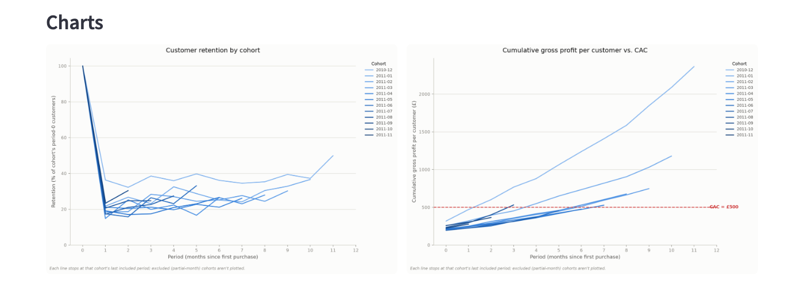

# Cohort & CAC Payback Analysis

A Streamlit app that turns raw e-commerce transactions into cohort
retention, revenue, and CAC-payback analysis. Upload any transaction CSV
with `CustomerID`, `InvoiceDate`, `Quantity` and `UnitPrice`, enter a CAC
and a gross margin assumption, and get cohort matrices, retention curves,
and a payback chart — all downloadable as PNGs/CSV/ZIP.

**Try it live:** _link pending deployment_
**Run locally:** see [Running locally](#running-locally) below.


_Screenshot: the app's retention-curve and CAC-payback charts, run against
the sample Online Retail dataset with a £500 CAC and 50% gross margin._

## Three findings from the sample dataset

Running the app against the bundled UCI Online Retail dataset (Dec 2010 –
Dec 2011, UK-based online gift retailer) surfaces three things worth
knowing before trusting a naive cohort analysis:

1. **Cancellations quietly inflate revenue if you don't net them against
   the sale they reverse.** Simply dropping negative-quantity rows (the
   obvious first fix) leaves the original purchase fully counted while its
   return disappears. Matching each cancellation back to the purchase(s)
   of the same product by the same customer removes a further **£542,941**
   of revenue (about 6% of gross) that a naive "just drop the negatives"
   cleaning step would have left in. ~21,400 returned units had no
   matching purchase in the data at all (pre-existing stock, gifts, or a
   return for a purchase outside the observed window).

2. **Retention falls off a cliff after month 1, then plateaus — with a
   seasonal bump.** The founding Dec-2010 cohort drops from 100% to ~36%
   retention in a single month, then holds in the low-to-high 30s for most
   of the year — before jumping to ~50% in month 11 (a November
   pre-Christmas repeat-purchase spike, consistent with this being a gift
   retailer). The steep initial drop, not the plateau, is where most of
   the churn actually happens.

3. **CAC payback is highly cohort-dependent, and recency matters.** At an
   illustrative £500 CAC and 50% gross margin, the founding cohort pays
   back in 2 months and most cohorts through April 2011 pay back within
   7 months — but cohorts acquired from May 2011 onward mostly fail to pay
   back within the observed window. That's partly a real signal (later
   cohorts may simply be lower-value) and partly an artifact of having
   less time to observe them before the dataset ends — a reminder to read
   payback figures for your most recent cohorts with caution.

## How it works

The app cleans the data in a fixed order, tracking what's removed at each
step:

1. Drop rows with an unparseable `InvoiceDate`.
2. Drop rows with a missing `CustomerID` (tracked with the revenue this
   excludes).
3. Drop exact duplicate rows.
4. **Net cancellations against the purchases they reverse** (needs a
   `StockCode` column — matches each return to the customer's most recent
   prior purchase of the same product, consuming partial quantities where
   needed; without `StockCode`, cancellations are just dropped).
5. Drop rows with `UnitPrice <= 0`.

Each surviving customer gets a cohort = the month of their first
purchase. Each transaction gets a period index = months since that
cohort month. If the data's last calendar month is partial (doesn't reach
that month's last day), it's excluded from all matrices/charts so it
doesn't understate every active cohort's most recent period — a cohort
whose first purchase falls in that excluded month shows up as a
greyed-out row instead.

From there the app builds: a customer-count matrix, a revenue matrix, a
retention % matrix, and a cumulative-revenue-per-customer matrix — each
as a heatmap and a table — plus a retention-curve chart and a
cumulative-gross-profit-vs-CAC chart with per-cohort payback periods.

## Running locally

```
pip install -r requirements.txt
streamlit run app.py
```

Click **"Use sample dataset"** to try it against the bundled
`Online_Retail.csv` without uploading anything.

## Secrets

This app doesn't currently call any external API and has no secrets to
configure. If that changes, put credentials in `.streamlit/secrets.toml`
(already gitignored) rather than hardcoding them.

## Data

`Online_Retail.csv` is included as sample data — Online Retail dataset,
Daqing Chen, UCI Machine Learning Repository (London South Bank
University).
